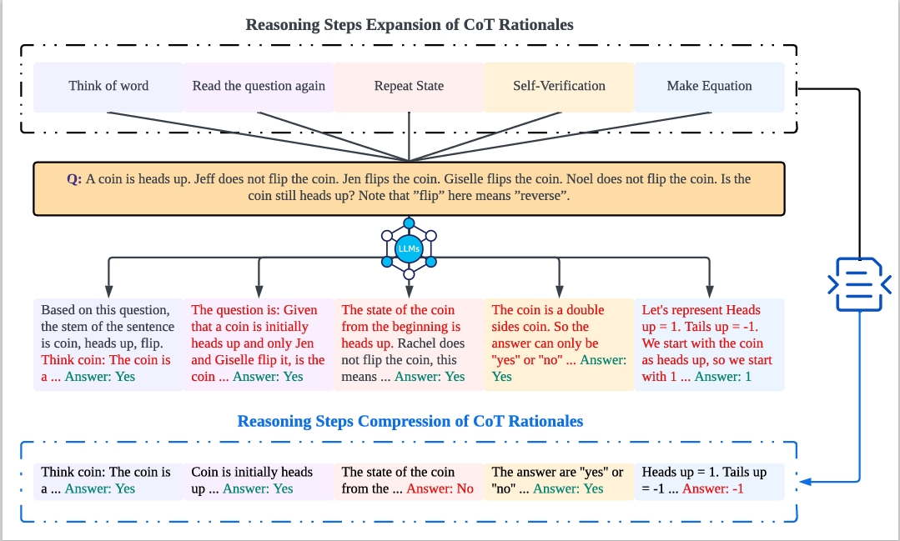

# The Impact of Reasoning Step Length on Large Language Models


Created by [Mingyu Jin]()\*, Qinkai Yu\*, Dong Shu, Haiyan Zhao, Wenyue Hua, Yanda Meng†, Yongfeng Zhang†, Mengnan Du†
This repository contains PyTorch implementation of "The Impact of Reasoning Step Length on Large Language Models"

The paper has been accepted by ACL 2024 findings. 

[[arXiv]](https://arxiv.org/abs/2401.04925) https://arxiv.org/abs/2401.04925

[[ACL]](https://aclanthology.org/2024.findings-acl.108/) https://aclanthology.org/2024.findings-acl.108/

## Installation
Make sure you have Python>=3.8 installed on your machine.

```bash
pip install torch==1.8.2+cu111 torchtext==0.9.2 -f https://download.pytorch.org/whl/lts/1.8/torch_lts.html
pip install -r requirements.txt
```
## Datasets 
Download the datasets from the following:
```
https://github.com/kojima-takeshi188/zero_shot_cot/tree/main/dataset
https://github.com/kojima-takeshi188/zero_shot_cot/tree/main/log
```
## Run inference
```bash
python run_inference.py --dataset multiarith --demo_path demos/multiarith --output_dir experiment/multiarith
```
## Use demo 
### Relationship Between Steps and Accuracy
last_letter_1 represents adding one step to the demo

last_letter_2 represents adding two-step to the demo


.......and so on

```bash
python run_inference.py --dataset last_letter --demo_path demos/last_letter_1 --output_dir experiment/last_letters_1 #1 represent the number of add step
```

### Effect of Prompt with Wrong Answer
```bash
python run_inference.py --dataset last_letter --demo_path demos/last_letters_false --output_dir experiment/last_letters_false
```
## Create demo


## Citation 
If you find this codebase helpful, please consider to cite:
```
@article{jin2024impact,
  title={The Impact of Reasoning Step Length on Large Language Models},
  author={Jin, Mingyu and Yu, Qinkai and Zhao, Haiyan and Hua, Wenyue and Meng, Yanda and Zhang, Yongfeng and Du, Mengnan and others},
  journal={ACL},
  year={2024}
}

@article{jin2024impact,
  title={The Impact of Reasoning Step Length on Large Language Models},
  author={Jin, Mingyu and Yu, Qinkai and Zhao, Haiyan and Hua, Wenyue and Meng, Yanda and Zhang, Yongfeng and Du, Mengnan and others},
  journal={arXiv preprint arXiv:2401.04925},
  year={2024}
}

@inproceedings{jin-etal-2024-impact,
    title = "The Impact of Reasoning Step Length on Large Language Models",
    author = "Jin, Mingyu  and
      Yu, Qinkai  and
      Shu, Dong  and
      Zhao, Haiyan  and
      Hua, Wenyue  and
      Meng, Yanda  and
      Zhang, Yongfeng  and
      Du, Mengnan",
    editor = "Ku, Lun-Wei  and
      Martins, Andre  and
      Srikumar, Vivek",
    booktitle = "Findings of the Association for Computational Linguistics ACL 2024",
    month = aug,
    year = "2024",
    address = "Bangkok, Thailand and virtual meeting",
    publisher = "Association for Computational Linguistics",
    url = "https://aclanthology.org/2024.findings-acl.108",
    pages = "1830--1842",
    abstract = "Chain of Thought (CoT) is significant in improving the reasoning abilities of large language models (LLMs). However, the correlation between the effectiveness of CoT and the length of reasoning steps in prompts remains largely unknown. To shed light on this, we have conducted several empirical experiments to explore the relations. Specifically, we design experiments that expand and compress the rationale reasoning steps within CoT demonstrations, while keeping all other factors constant. We have the following key findings. First, the results indicate that lengthening the reasoning steps in prompts, even without adding new information into the prompt, considerably enhances LLMs{'} reasoning abilities across multiple datasets. Alternatively, shortening the reasoning steps, even while preserving the key information, significantly diminishes the reasoning abilities of models. This finding highlights the importance of the number of steps in CoT prompts and provides practical guidance to make better use of LLMs{'} potential in complex problem-solving scenarios. Second, we also investigated the relationship between the performance of CoT and the rationales used in demonstrations. Surprisingly, the result shows that even incorrect rationales can yield favorable outcomes if they maintain the requisite length of inference. Third, we observed that the advantages of increasing reasoning steps are task-dependent: simpler tasks require fewer steps, whereas complex tasks gain significantly from longer inference sequences.",
}
```
